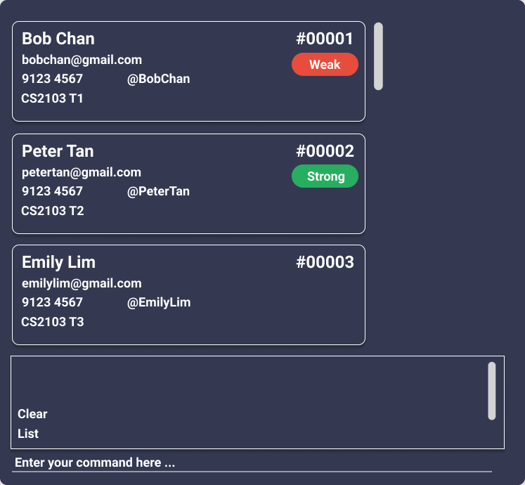

**EdRecord is a desktop application for teaching staff to easily monitor their classes, having an overview of their grades and deadlines track.** 
It is optimized for **CLI users** so that frequent tasks can be done faster by typing in commands.

- If you are interested in using EdRecord, head over to the [_Quick Start_ section of the **User Guide**](UserGuide.html#quick-start).
- If you are interested about developing EdRecord, the [**Developer Guide**](DeveloperGuide.html) is a good place to start.

**Acknowledgements**

This project is based on the AddressBook-Level3 project created by the [SE-EDU initiative](https://se-education.org).

- Libraries used: [JavaFX](https://openjfx.io/), [Jackson](https://github.com/FasterXML/jackson), [JUnit5](https://github.com/junit-team/junit5)
